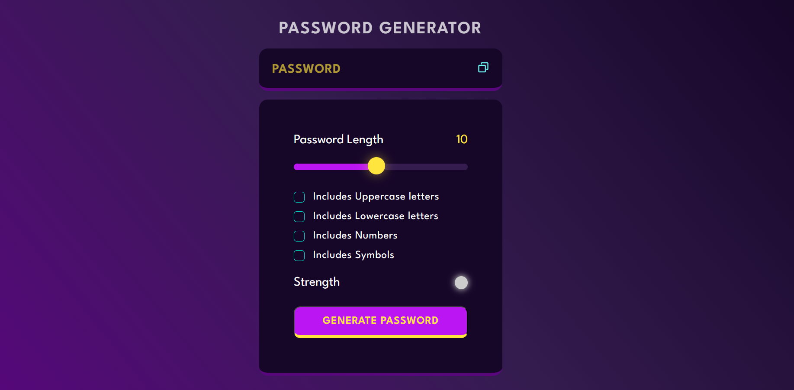
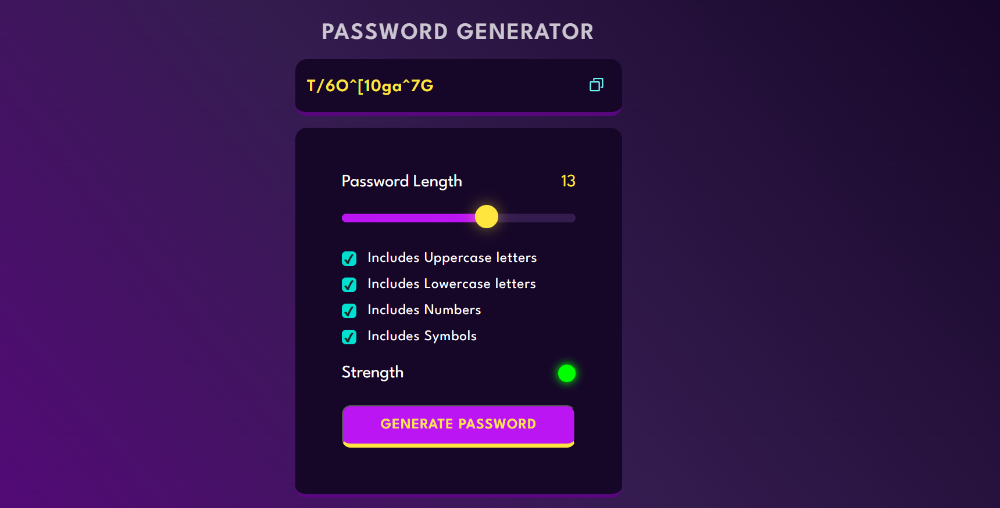

# 🔐 Random Password Generator

A responsive and interactive random password generator built using **HTML**, **CSS**, and **JavaScript**. It allows users to generate secure passwords with customizable options including length, uppercase/lowercase letters, numbers, and symbols.




---

## 🚀 Features

- 🔢 Adjustable password length (1-20 characters)
- 🔠 Option to include:
  - Uppercase letters
  - Lowercase letters
  - Numbers
  - Symbols
- 🌈 Visual strength indicator (weak, medium, strong)
- 📋 One-click password copy to clipboard
- 💡 Dynamic UI with real-time updates

---

## 🛠️ Technologies Used

- HTML5
- CSS3 (Custom Properties & Flexbox)
- JavaScript (DOM Manipulation, Event Handling)

---

## 📸 Preview

<p align="center">
  
</p>

---

## 📁 Project Structure

```bash
├── index.html         # Main HTML file
├── styles.css         # Styling
├── script.js          # Functionality logic
└── assets/            # Icons and images (e.g., copy icon, screenshots)
